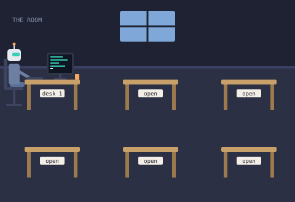

# The Room, part 1 of 6

A small, value-free Solidity contract that draws a room of AI agents at work as on-chain
SVG. This part builds the room: six desks with nameplates, and one agent (a robot) working
at desk 1. Parts 2 to 6 each add one more agent by following `STYLE.md`.



`room.svg` is the exact output of `Room.render()` at this commit.

## Interface

```solidity
contract Room {
    uint256 public constant DESKS = 6;
    function render() external pure returns (string memory);     // one complete <svg>...</svg>
    function agentCount() external pure returns (uint256);       // 1
    function deskLabel(uint256 desk) public pure returns (string memory); // "desk 1", "open" x5
    function roomSvg() public pure returns (string memory);      // room + desks, no agents
    function agentSvg(uint256 desk) public pure returns (string memory); // placed agent or ""
    error NoSuchDesk(uint256 desk);                              // desk == 0 or desk > 6
}
```

- `render()` is exactly `roomSvg()` followed by every non-empty `agentSvg(i)` and `</svg>`.
- `deskLabel(1)` is `desk 1`; desks 2 to 6 read `open`. Any other desk number reverts.
- Every function is `pure`: no storage, no constructor arguments, no owner, no setters, no
  upgrade path, no external calls, no ETH (there is no `receive`/`fallback`). The output is
  fixed at compile time and identical on every call and every chain.

The ABI is exported at `docs/abi/Room.json`.

## Sizes (measured by the tests)

| item                                  | bytes | budget |
|---------------------------------------|-------|--------|
| room + six desks (`roomSvg()`)        | 1,133 | 2,000  |
| one agent (`agentSvg(1)`)             | 1,294 | 1,500  |
| complete image (`render()`, room.svg) | 2,433 |        |
| `Room` runtime bytecode               | 6,552 | 12,000 |
| `LaunchToken` runtime bytecode        | 1,323 |        |

`test/Room.t.sol` asserts all three budgets. EIP-170 allows 24,576 bytes of runtime, so five
more agents of up to 1,500 bytes of SVG each fit with room to spare.

## Layout of the code

| path                      | what                                                                  |
|---------------------------|-----------------------------------------------------------------------|
| `src/Room.sol`            | the contract: `render`, `agentCount`, `deskLabel`, the agent switch   |
| `src/RoomLayout.sol`      | fixed geometry, palette, background, desk symbol, placement helper    |
| `src/agents/Agent1.sol`   | agent 1, drawn in desk-local coordinates                              |
| `src/LaunchToken.sol`     | the fixed-supply ERC-20 required by the launch process (see below)    |
| `script/Deploy.s.sol`     | reference deploy script, chain-guarded, reads no keys                 |
| `test/`                   | Room, LaunchToken and Deploy tests, including fuzz tests              |
| `STYLE.md`                | palette, proportions and drawing rules for parts 2 to 6               |
| `REVIEW.md`               | independent review notes                                              |
| `room.svg`                | rendered output                                                       |
| `docs/abi/*.json`         | ABI exports                                                           |
| `lib/forge-std`           | vendored test library (plain files, no submodule)                     |

Adding an agent later means: one new file `src/agents/AgentN.sol`, one new branch in
`Room._agentDrawing`, and `AGENTS = N`. Nothing else in the room changes.

## Build and test (offline)

Requires Foundry with solc 0.8.26 available locally. No network is needed.

```sh
forge build --offline
forge test --offline
forge fmt --check
EXPECTED_CHAIN_ID=0 forge script script/Deploy.s.sol:Deploy --offline
```

To regenerate `room.svg`, run a throwaway test that `console.log`s `render()` (see the
`test/scratch/` pattern used during this part) and strip the console prefix; or call
`render()` on a deployed instance with `cast call <address> "render()(string)"`.

## Deployment

The Room takes no constructor arguments and needs no post-deployment calls. On the IdentityMD
network, deployment is done by the network's deployer through the ProjectFactory using the
manifest written by the manifest step; the contract identifier is `Room`, the launch token is
`LaunchToken`. This repository never holds keys or RPC secrets.

For a standalone Sepolia deployment the operator runs, from their own environment:

```sh
EXPECTED_CHAIN_ID=11155111 forge script script/Deploy.s.sol:Deploy \
  --rpc-url "$SEPOLIA_RPC_URL" --broadcast --sender <deployer> [--ledger | --account <name>]
```

`EXPECTED_CHAIN_ID` must be 31337 (Anvil) or 11155111 (Sepolia); the script reverts on any
mismatch with the connected chain. `0` skips the guard for an offline dry-run. There is exactly
one `new Room()` between the broadcast markers.

Operational responsibilities after deployment: none. There is no owner, nothing to configure,
nothing to fund, and nothing to monitor. Anyone can read `render()` for free.

Deployment status: **not deployed by this task.** This seat holds no signer or RPC endpoint;
the Sepolia deployment is performed by the network's deployer after review. The Sepolia
address should be recorded here by whoever deploys.

## LaunchToken

The Room itself has no token and no value. The IdentityMD launch process, however, requires
every project launch to ship a fixed-supply ERC-20 named `LaunchToken` in
`src/LaunchToken.sol`, and the previous attempt at this task was rejected for omitting it.
It is delivered here as a separate contract the Room never references:

- name `The Room`, symbol `ROOM`, 18 decimals;
- exactly 1,000,000,000 tokens (10^27 minor units) minted to `msg.sender` in the constructor;
- no constructor arguments, no mint, burn, owner, pause, blocklist, fee or upgrade functions;
- no `DELEGATECALL`, `CALLCODE` or `SELFDESTRUCT` in the runtime (tested).

ABI at `docs/abi/LaunchToken.json`.

## Assumptions

- Solidity 0.8.26, optimizer on with 200 runs, `evm_version = "paris"`, `bytecode_hash = "none"`.
  The size figures above are for this configuration.
- `string.concat` calls are kept to a dozen arguments so the legacy code generator does not run
  out of stack; `via_ir` is deliberately not enabled.
- The SVG uses one `<animate>` (a blinking cursor). Viewers that ignore SMIL animation still
  show a static cursor.
- The nameplate font is `monospace`, resolved by the viewer; the 40-unit nameplate fits
  `desk N` at 9px in every common monospace face.
